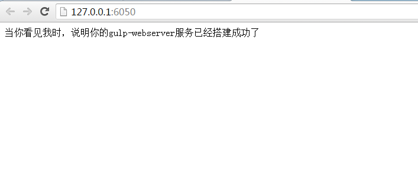

# gulp-webserver

用gulp-webserver搭建简单的前端测试服务器，方便前端测试使用。

---
### 截图

---




### 安装
项目地址：（使用`git clone`）

```shell
git clone https://github.com/zhuimeikeji/gulp-webserver.git
```

通过`npm`安装本地服务第三方依赖模块(需要已安装[Node.js](https://nodejs.org/))，使用npm安装依赖模块可能会很慢，建议换成[cnpm](http://cnpmjs.org/)

```shell
npm install -g cnpm --registry=http://registry.npm.taobao.org
```

```bash
# 先全局安装GULP，才能使用GULP命令
npm install -g gulp

# 安装依赖模块
npm install

# 启动服务
gulp dev

```
